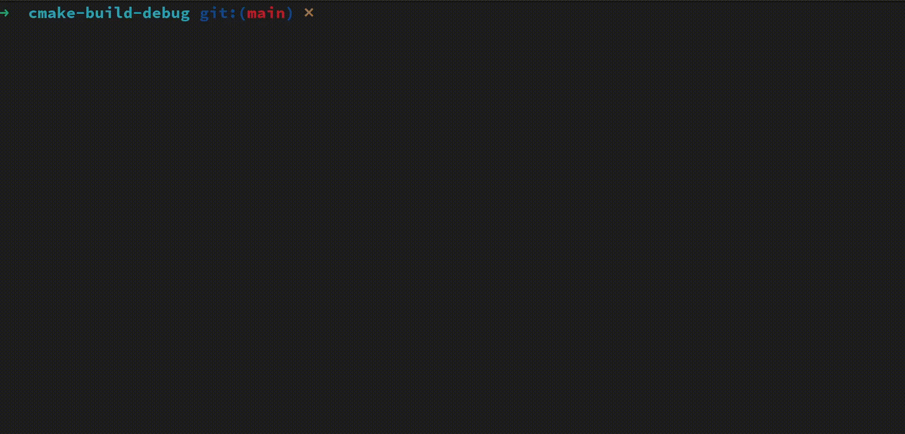

# 15 puzzle

Simple implementation of 15 puzzle in C++ using ncurses.

Goal is get all numbers rearranged into numerical order from left to right, top to bottom.



## Run
```shell
$ cmake -S . -B build
$ cd build
$ ./15game
```